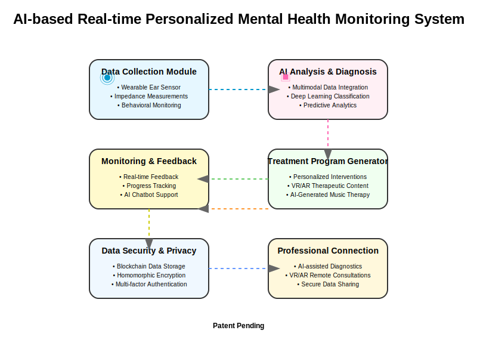

# AI-based Real-time Personalized Mental Health Monitoring System

A comprehensive system for real-time monitoring and personalized treatment of mental health conditions using AI, wearable sensors, and multimodal data analysis.

## System Overview

The AI-based Real-time Personalized Mental Health Monitoring System is a cutting-edge solution designed to accurately diagnose, monitor, and treat mental health conditions through the integration of advanced technologies including:

- Wearable biosensors with frequency-scanning impedance measurement
- Edge AI for real-time data processing
- Multimodal data analysis and integration
- Personalized treatment program generation
- VR/AR-based therapeutic content
- Blockchain-based secure data management

## Key Features

### 1. Data Collection Module

- **Ear-insertable Biosensor**: Miniaturized sensor (3mm diameter, 8mm length) for collecting high-fidelity biometric data
- **Frequency-scanning Impedance Technology**: User-specific frequency scanning for personalized biomarker detection
- **Multimodal Data Collection**: Collects EEG, body temperature, blood flow, electrochemical impedance measurements
- **Behavioral Pattern Analysis**: Monitors smartphone usage, GPS location, sleep patterns, and social media activity
- **Emotion Recognition**: AI-based facial expression, voice tone, and text sentiment analysis

### 2. AI Analysis & Diagnosis Module

- **Multimodal Data Integration**: Combines physiological, behavioral, emotional, and contextual data
- **Deep Learning Diagnostics**: Uses CNN, RNN, and Transformer models for mental health condition diagnosis
- **Time-series Analysis**: LSTM networks for temporal pattern analysis and change detection
- **Anomaly Detection**: Unsupervised learning algorithms for detecting irregular patterns
- **Predictive Modeling**: Machine learning models for forecasting mental health trajectory

### 3. Personalized Treatment Program Generation

- **Individualized Treatment Plans**: Customized based on mental health state, personality, lifestyle, and preferences
- **AI-generated Digital Therapeutics**: Cognitive behavioral therapy, mindfulness meditation, exposure therapy
- **VR/AR-based Treatments**: Immersive therapeutic content with real-time adaptation
- **Real-time Generated Music Therapy**: AI-composed therapeutic music based on emotional state
- **Adaptive Exercise & Nutrition**: Personalized physical wellbeing programs

### 4. Treatment Delivery & Monitoring

- **Multi-platform Support**: Smartphone apps, wearable devices, VR/AR headsets, smart speakers
- **Real-time Feedback System**: Continuous analysis of user responses for immediate program adjustment
- **AI Chatbot Counselor**: 24/7 emotional support and guidance through natural language processing
- **Emotion Visualization**: Visual representation of emotional state changes over time
- **Progress Reporting**: Regular updates on treatment progress and improvements

### 5. Data Security & Privacy

- **Blockchain Data Storage**: Secure, encrypted storage of mental health data
- **Homomorphic Encryption**: Analysis of encrypted data without decryption
- **Multi-factor Authentication**: Biometric and behavioral pattern authentication
- **Data Anonymization**: Personal identifier removal for research and analysis
- **Smart Contracts**: Blockchain-based management of data use permissions

### 6. Professional Connection

- **AI-assisted Diagnostics**: Supporting professional diagnosis with AI analysis
- **VR/AR Remote Consultation**: Immersive remote consultation environment
- **Secure Data Sharing**: Consent-based sharing of collected data with professionals
- **Collaborative Treatment Management**: Integrated system for AI and professional cooperation

## System Architecture

The system follows a modular architecture with six core components interconnected through secure data channels:

1. **Data Collection Module**: Gathers biometric signals, behavioral patterns, emotional states
2. **AI Analysis & Diagnosis Module**: Processes collected data to diagnose mental health conditions
3. **Treatment Program Generation Module**: Creates personalized therapeutic interventions
4. **Treatment Delivery & Monitoring Module**: Delivers treatments and monitors responses
5. **Data Security & Privacy Module**: Ensures secure data handling and user privacy
6. **Professional Connection Module**: Facilitates collaboration with mental health professionals

## Technology Stack

- **Wearable Hardware**: Ultra-compact impedance sensors, nano energy harvesting, edge AI chips
- **AI & ML**: Deep learning (CNN, RNN, Transformer), time-series analysis (LSTM), anomaly detection
- **Security**: Blockchain ledger, homomorphic encryption, multi-factor authentication
- **Therapeutic Delivery**: VR/AR platforms, AI-generated content, real-time adaptation algorithms
- **Data Processing**: Edge computing, cloud infrastructure, real-time analytics

## Applications

- Early detection and prevention of mental health issues
- Continuous monitoring of mental health conditions
- Personalized treatment of depression, anxiety, stress, bipolar disorder, ADHD
- Remote mental health care access
- Objective assessment of treatment efficacy
- Research data collection for mental health studies

## Patent Pending
