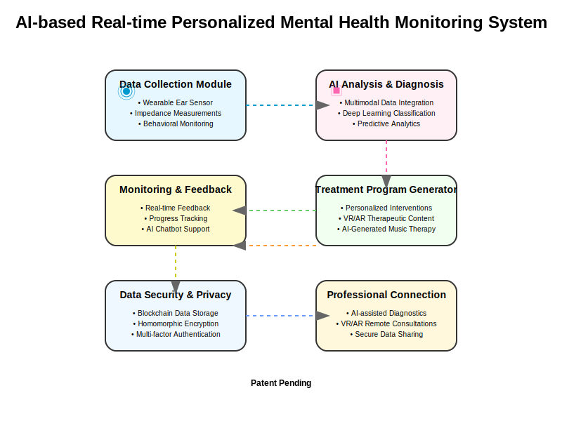

# System Architecture Documentation

## Overview

The AI-based Real-time Personalized Mental Health Monitoring System is designed as a modular, scalable platform that integrates various components for comprehensive mental health monitoring and treatment. The system follows a layered architecture with six primary modules, each responsible for specific functionalities.

## Modules

### 1. Data Collection Module (110)

#### Purpose
Collect real-time biometric, behavioral, emotional, and contextual data from users.

#### Components

##### 1.1 Ear-Insertable Biosensor
- **Dimensions**: 3mm diameter, 8mm length
- **Materials**: Biocompatible medical-grade silicone exterior with internal sensor modules
- **Measurement Capabilities**:
  - EEG: 16-channel high-resolution brain wave measurement (0.1-100Hz band)
  - Temperature: Core temperature monitoring with 0.01°C precision
  - Blood Flow: Near-infrared spectroscopy for blood flow and oxygen saturation
  - Electrochemical Impedance: Real-time neurotransmitter and hormone level measurement

##### 1.2 Wearable Sensors
- Ultra-compact semiconductor-based sensors
- Heart rate, EEG, skin conductance, respiration, body temperature, blood pressure, glucose, hormone level monitoring

##### 1.3 Behavioral Analysis System
- Smartphone usage pattern tracking
- GPS location monitoring
- Social media activity analysis
- Physical activity tracking
- Sleep pattern analysis
- Dietary habit monitoring

##### 1.4 Emotion Recognition System
- AI-based facial expression analysis
- Voice tone analysis
- Text sentiment analysis

##### 1.5 Contextual Information System
- Current activity detection
- Time, location, weather tracking
- Social situation and environmental context collection

#### Data Processing
- On-device edge AI for real-time preprocessing
- Noise filtering and data normalization
- Preliminary anomaly detection
- Secure data encryption before transmission

#### Power Management
- Nano energy harvesting technology for self-charging
- Up to 1 month continuous operation
- Low power consumption design

### 2. AI Analysis & Diagnosis Module (120)

#### Purpose
Process and analyze collected data to diagnose and predict mental health conditions.

#### Components

##### 2.1 Data Preprocessing Layer
- Noise removal algorithms
- Data normalization
- Missing value handling
- Signal processing (wavelet transform, Kalman filters, Fourier transform)

##### 2.2 Feature Extraction Layer
- Time-domain analysis
- Frequency-domain analysis
- Non-linear dynamics analysis
- Statistical feature computation

##### 2.3 Multimodal Data Integration Layer
- Transformer-based multimodal encoder
- Cross-modal representation learning
- Temporal alignment of multimodal data
- Feature fusion strategies

##### 2.4 Diagnostic Models
- **Model Architecture**: Hybrid models combining CNN, LSTM, Transformer architectures
- **Training Data**: Pre-trained on 1M+ mental health datasets
- **Accuracy**: >95% accuracy for major mental health condition diagnosis
- **Supported Diagnoses**: Depression, anxiety disorders, stress, bipolar disorder, ADHD
- **Update Mechanism**: Continuous learning with federated privacy-preserving techniques

##### 2.5 Explainable AI (XAI) Module
- SHAP (SHapley Additive exPlanations)
- LIME (Local Interpretable Model-agnostic Explanations)
- Attention visualization
- Feature importance ranking

##### 2.6 Time Series Prediction
- Prophet models for trend analysis
- DeepAR for time series forecasting
- Anomaly prediction algorithms
- Risk level assessment

### 3. Treatment Program Generation Module (130)

#### Purpose
Create personalized treatment programs based on AI analysis results.

#### Components

##### 3.1 Personalized Treatment Planning
- Treatment strategy selection based on diagnosis
- Individual adaptation based on user profile
- Dynamic adjustment based on progress

##### 3.2 AI-based Digital Therapeutics
- Cognitive behavioral therapy
- Mindfulness meditation
- Exposure therapy
- Behavioral activation
- Custom protocols for specific conditions

##### 3.3 VR/AR Content Generation
- **Hardware Specifications**:
  - VR: 8K resolution, 200° field of view, haptic feedback
  - AR: Transparent display, eye-tracking sensors, spatial mapping
- **Treatment Programs**:
  - Anxiety exposure therapy
  - PTSD treatment
  - Depression cognitive behavioral therapy
  - Addiction treatment
  - Social anxiety training

##### 3.4 Music Therapy Generator
- Emotional state-responsive composition
- Binaural beats for brainwave entrainment
- Personalized soundscapes
- Therapeutic frequency patterns

##### 3.5 Exercise & Nutrition Management
- Personalized physical activity recommendations
- Nutrition guidance for mental health support
- Sleep optimization routines
- Stress reduction techniques

### 4. Treatment Delivery & Monitoring Module (140)

#### Purpose
Deliver treatment programs and monitor user responses in real-time.

#### Components

##### 4.1 Multi-platform Delivery
- Smartphone app interface
- Wearable device integration
- VR/AR headset compatibility
- Smart speaker interface

##### 4.2 Real-time Feedback System
- Continuous biometric monitoring during treatment
- Emotional state tracking
- Engagement level assessment
- Efficacy evaluation metrics

##### 4.3 AI Chatbot Counselor
- Natural language processing for conversation
- Emotional support algorithms
- Crisis detection and response
- Therapeutic dialogue techniques

##### 4.4 Emotion Visualization
- Temporal emotion mapping
- Mood tracking dashboards
- Trigger identification
- Pattern recognition visualization

##### 4.5 Progress Reporting
- Regular assessment scheduling
- Improvement metrics
- Comparative analytics
- Simplified visualization for users
- Detailed reporting for professionals

### 5. Data Management & Security Module (150)

#### Purpose
Ensure secure storage, processing, and sharing of sensitive mental health data.

#### Components

##### 5.1 Blockchain Data Storage
- Encrypted distributed ledger
- Immutable record keeping
- Auditable access trails
- Decentralized data architecture

##### 5.2 Homomorphic Encryption
- Encrypted data processing without decryption
- Privacy-preserving analytics
- Secure multi-party computation
- Zero-knowledge proofs

##### 5.3 Authentication Systems
- Biometric authentication (fingerprint, facial, voice)
- Behavioral pattern recognition
- Multi-factor authentication
- Continuous identity verification

##### 5.4 Data Anonymization
- Personal identifier removal
- k-anonymity implementation
- Differential privacy techniques
- Synthetic data generation

##### 5.5 Smart Contracts
- Automated permission management
- Consent tracking and verification
- Data usage policies enforcement
- Access control delegation

### 6. Professional Connection Module (160)

#### Purpose
Facilitate collaboration between the AI system and mental health professionals.

#### Components

##### 6.1 AI-assisted Diagnostic Support
- Clinical decision support systems
- Diagnostic suggestion with confidence levels
- Longitudinal data presentation
- Research evidence integration

##### 6.2 Remote Consultation Platform
- VR/AR-based immersive consultation environment
- Secure video conferencing
- Real-time data sharing during sessions
- Interactive therapeutic tools

##### 6.3 Data Sharing System
- Consent management interface
- Selective data sharing options
- Standardized clinical data formats
- Interoperability with electronic health records

##### 6.4 Collaborative Treatment Management
- Combined AI-professional treatment planning
- Role delineation protocols
- Escalation pathways
- Continuous feedback loops

## System Integration

### Data Flow
1. The Data Collection Module (110) continuously gathers biometric signals, behavioral data, emotional states, and contextual information.
2. Collected data is securely transmitted to the AI Analysis & Diagnosis Module (120).
3. The AI module processes the data, performs diagnostics, and sends results to the Treatment Program Generation Module (130).
4. Personalized treatment programs are created and forwarded to the Treatment Delivery & Monitoring Module (140).
5. The monitoring module delivers treatments and tracks user responses.
6. All data is securely stored and managed by the Data Management & Security Module (150).
7. When necessary, data and insights are shared with mental health professionals through the Professional Connection Module (160).

### Integration Points
- Standardized APIs between modules
- Event-driven architecture for real-time communication
- Data transformation services between modules
- Centralized configuration management
- Distributed logging and monitoring

### Fail-safe Mechanisms
- Redundant data storage
- Offline operation capabilities
- Automatic recovery procedures
- Emergency alert systems
- Human oversight protocols

## Technology Stack

### Hardware
- Custom silicon for wearable sensors
- Edge AI processors
- Secure communication modules
- Energy harvesting components
- VR/AR headsets with biosensor integration

### Software
- Real-time operating system for edge devices
- Deep learning frameworks (TensorFlow, PyTorch)
- Blockchain platform (Hyperledger)
- Homomorphic encryption libraries
- Natural language processing engines
- VR/AR development frameworks

### Infrastructure
- Edge computing nodes
- Secure cloud storage
- Federated learning servers
- Blockchain nodes
- Content delivery network

## Deployment Considerations

### Scalability
- Microservices architecture
- Containerized deployment
- Elastic compute resources
- Sharded database design
- Load balancing strategies

### Security
- End-to-end encryption
- Regular security audits
- Penetration testing
- Compliance with healthcare regulations (HIPAA, GDPR)
- Data residency considerations

### Personalization
- User preference settings
- Adaptive learning algorithms
- Cultural and linguistic adaptation
- Accessibility features
- Age-appropriate content filtering

## Future Expansion

The modular design allows for:
- Integration with additional sensor types
- Support for new mental health conditions
- Expanded therapeutic methodologies
- Enhanced AI capabilities through continued learning
- Integration with broader healthcare ecosystems
